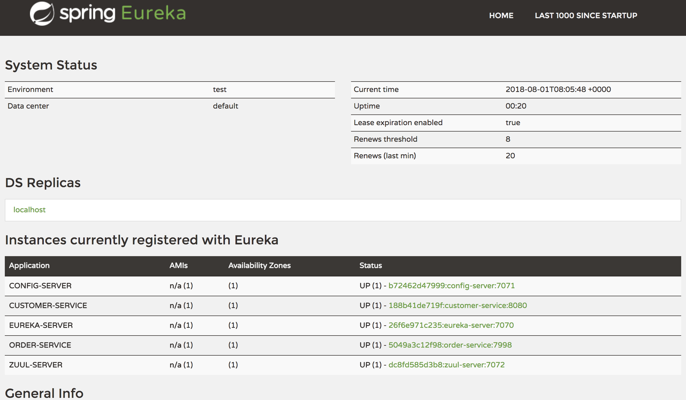

# docker로 실행하기

MSA-COE 예제를 docker로 구동을 해보도록 하겠습니다.

# 1. plugin 추가

docker build를 이용하여 이미지를 만들기 위해서는 플러그인이 필요합니다.

* build.gradle 수정

~~~groovy
buildscript {
  ...
    repositories {
    ...
        maven {
            url "https://plugins.gradle.org/m2/"
        }
    }
    dependencies {
        ...
        classpath('gradle.plugin.com.palantir.gradle.docker:gradle-docker:0.13.0')
    }
}

...
apply plugin: 'com.palantir.docker'
...
docker {
    dependsOn build
    name "${bootJar.baseName}"
    files bootJar.archivePath
    buildArgs(['JAR_FILE': "${bootJar.archiveName}"])
}
~~~

* pom.xml 수정

~~~xml
...
<properties>
      ...
      <docker.image.prefix>springio</docker.image.prefix>
</properties>
<build>
        <plugins>
            ...
            <plugin>
                <groupId>com.spotify</groupId>
                <artifactId>dockerfile-maven-plugin</artifactId>
                <version>1.3.6</version>
                <configuration>
                    <repository>${project.artifactId}</repository>
                    <buildArgs>
                        <JAR_FILE>target/${project.build.finalName}.jar</JAR_FILE>
                    </buildArgs>
                </configuration>
            </plugin>
        </plugins>
</build>
~~~

gralde과 maven에서 사용되는 플러그인은 서로 다릅니다.

따라서 세부적인 사용법이 다릅니다.(ex. gralde에서 docker build시에 다른 파일을 추가하기 위해서는 build.gradle의 docker.files 수정 필요)

# 2. Dockerfile 추가

위에서 추가한 플러그인을 이용해서 실행하기 위해서는 아래와 같이 Dockerfile을 만들어 줍니다. Dockerfile은 docker build 명령어를 실행하기 위해서 필수로 존재해야 하는 파일입니다.

~~~Dockerfile
FROM openjdk:8-jdk-alpine
VOLUME /tmp
ARG JAR_FILE
COPY ${JAR_FILE} app.jar
ENTRYPOINT ["java","-Djava.security.egd=file:/dev/./urandom","-jar","/app.jar"]
~~~

# 3. Eureka Docker 빌드

위와 같이 플러그인을 설치하고 Dockerfile을 만들었다면

아래와 같이 명령어를 입력합니다.

* gradle 실행

~~~bash
$ ./gradlew docker build
~~~

* mvn 실행

~~~
$ mvn install dockerfile:build
~~~

정상적으로 빌드가 되었다면 image 가 생성 되었는지 확인합니다.
~~~bash
$ docker images
REPOSITORY          TAG                 IMAGE ID            CREATED             SIZE
coe-eureka          latest              a2f46b885f6b        About an hour ago   153MB
~~~

# 4. config-server Docker 빌드

config-server 프로젝트의 application.yml을 열어서 다음과 같이 추가합니다.

~~~yml
...
---
spring:
  profiles: docker
eureka:
  client:
    serviceUrl:
      defaultZone: http://coe-eureka:${EUREKA_SERVER_URL:7070}/eureka/
      # defaultZone: ${EUREKA_SERVER_URL}:${EUREKA_SERVER_PORT:7070}/eureka/
~~~

기존과 다른 점은 유레카 서버의 주소를 직접 입력 받는것이 아니라 유레카 서버의 컨테이너 이름을 입력하는 것입니다.

위와 같이 수정한 이후 docker 빌드를 합니다.

빌드가 되었다면 이미지가 생성 되었는지 확인합니다.
~~~bash
$ docker images
REPOSITORY          TAG                 IMAGE ID            CREATED                  SIZE
config-server       latest              5f6ed0509a99        Less than a second ago   147MB
~~~

# 5. customer-service Docker 빌드
 bootstrap.yml 파일을 열어서 아래와 같이 추가합니다.

~~~yml
...
---
spring:
  profiles: docker
  cloud:
    config:
      discovery:
        enabled: true
        service-id: CONFIG-SERVER
eureka:
  client:
    serviceUrl:
      defaultZone: http://coe-eureka:${EUREKA1_SERVER_PORT:7070}/eureka/
 ~~~

그리고 config git 경로에 customer-service-docker.yml 파일을 생성하고 아래와 같이 입력합니다.

~~~yml
spring:
  application:
    name: customer-service-local
  rabbitmq:
    host: rabbitmq
    port: 5672
    username: username
    password: password
  jpa:
    hibernate:
      ddl-auto: create-drop
      show-sql: true
  datasource:
    sql-script-encoding: UTF-8
    driverClassName: org.h2.Driver
    url: jdbc:h2:mem:customer;MODE=MYSQL;DB_CLOSE_ON_EXIT=FALSE
    username: ${DB_USERNAME:sa}
    password: ${DB_PASSWORD:}
management:
  endpoints:
    web:
      exposure:
        include: "*"
~~~

추가로 EurekaConfig 파일의 내용이 현재 local이 아닐 경우 AWS에서 사용되는 설정을 가지고 있는데 해당 빈을 지우거나 아니면 아래와 같이 Condition 인터페이스를 구현하여 사용합니다.

이유는 기존 Profile 어노테이션의 경우 AND 조건이 되지 않기 때문입니다.

~~~java
import com.netflix.appinfo.AmazonInfo;
import org.springframework.beans.factory.annotation.Value;
import org.springframework.cloud.commons.util.InetUtils;
import org.springframework.cloud.netflix.eureka.EurekaInstanceConfigBean;
import org.springframework.context.annotation.*;
import org.springframework.core.type.AnnotatedTypeMetadata;

@Configuration
public class EurekaConfig {

    @Value("${server.port}")
    private int port;

    // THIS BEAN IS USED IN ONLY AWS
    @Bean
    //@Profile({"!docker"})
    @Conditional(ProfileCondition.class)
    public EurekaInstanceConfigBean eurekaInstanceConfigBean(InetUtils inetUtils) {
        EurekaInstanceConfigBean b = new EurekaInstanceConfigBean(inetUtils);
        AmazonInfo info = AmazonInfo.Builder.newBuilder().autoBuild("eureka");
        b.setDataCenterInfo(info);
        b.setHostname(info.get(AmazonInfo.MetaDataKey.publicHostname));
        b.setIpAddress(info.get(AmazonInfo.MetaDataKey.publicIpv4));
        b.setNonSecurePort(port);
        return b;
    }
}

class ProfileCondition implements Condition {
    @Override
    public boolean matches(ConditionContext context, AnnotatedTypeMetadata metadata) {
        return !context.getEnvironment().acceptsProfiles("local")
                && !context.getEnvironment().acceptsProfiles("docker");
    }
}
~~~

그리고 도커 빌드를 통하여 이미지를 생성합니다.

# 6. order-service Docker 빌드

customer서비스 처럼 bootstrap을 수정하고 order-service-docker.yml파일을 작성한 이후에 EurekaConfig 파일도 위와 같이 수정합니다.

이후 도커 빌드를 통하여 이미지를 생성합니다.

# 7. zuul Docker 빌드

zuul-server 프로젝트의 bootstrap.yml을 열어서 다음과 같이 추가합니다.

~~~yml
...
---
spring:
  profiles: docker
  cloud:
    loadbalancer:
      retry:
        enabled: true
    config:
      discovery:
        enabled: true
        service-id: config-server
eureka:
  client:
    serviceUrl:
      defaultZone: http://coe-eureka:${EUREKA_SERVER_PORT:7070}/eureka/

~~~

그리고 config git 경로에 zuul-server-docker.yml파일을 만들어 줍니다.
파일 내용은 다른 active 파일과 동일합니다.

docker 빌드를 수행합니다.

# 8. docker-compose 파일 생성

위에서 생성된 이미지를 docker-compose.yml을 작성하여 실행하도록 합니다.

compose는 다중 컨테너 도커 응용프로그램을 실행하기 위한 도구입니다.

compose는 프로젝트 이름을 사용하여 서로의 환경을 격리합니다. 그리고 이러한 상황에서 서로의 이름을 호출하여 사용 할 수 있습니다.

자세한 설명은 주석에 적어두었습니다.

~~~yml
#docker-compose 버전으로 버전에 따라 지원되는 기능이 다르니 docs.docker.com을 참조
version: '3.2'
services:
    #해당 이름은 docker ps 에 나오는 이름과 다릅니다 만약 컨테이너 이름을 지정해주고 싶으면
    #container_name: 을 이용하시길 바랍니다.
    rabiitmq:
        # 실행할 도커 이미지로 기본적으로 docker hub에서 가져옵니다.
        image: rabbitmq:3.7.7-management
        # 컨테이너 실행시 사용될 변수입니다. rabbitmq의 기본 사용자와 기본 비밀번호를 정의
        environment:
          RABBITMQ_DEFAULT_USER: username
          RABBITMQ_DEFAULT_PASS: password
        # 포트 바인딩
        ports:
          - 15672:15672
          - 5672:5672
        # restart policy로 기본값은 no
        # always의 경우 실패나 도커 재시작시 항상 컨테이너를 재 실행합니다.
        # on-faiure의 경우 컨테이너가 실패시 재실행을 합니다.
        restart: always
    eureka-server:
        image: coe-eureka
        # spring_profies_active를 docker로 설정하여
        # application.yml을 읽어 올 때 docker 부분을 실행하도록 환경변수를 주었습니다.
        # 그 외 application 프로퍼티에 사용 될 변수 바인딩을 이 곳에서 입력하면 됩니다.
        environment:
          SPRING_PROFILES_ACTIVE: docker
          EUREKA_SERVER_URL: http://localhost
          PORT: 7070
        restart: always
        ports:
          - 7070:7070
    config-server:
        image: config-server
        entrypoint: /bin/sh
        # 아래의 명령을 통해서 유레카 서버가 정상적으로 동작 되어야지 해당 컨테이너가 실행하도록 하였습니다.
        # compose의 경우 compose 파일에 정의된 컨테이너들이 한꺼번에 실행 되기 때문에
        # 아래의 명령어가 없으면 유레카를 찾지 못하기 때문입니다.
        # compose 2.1 버전의 경우 depends_on.condition 조건과 healthcheck 조건을 통해서 할 수 있었지만
        # 3 버전부터는 지원이 되지 않기 때문에 아래와 같이 별도 명령어를 통해서 순서를 보장하였습니다.
        command: -c "while !(nc -z eureka-server 7070); do sleep 5; echo 'Waiting for Eureka'; done; java -jar /app.jar"
        environment:
          SPRING_PROFILES_ACTIVE: docker
        restart: always
        ports:
          - 7071:7071
    zuul-server:
        image: zuul-server
        entrypoint: /bin/sh
        command:  -c "while !(wget http://config-server:7071/actuator/health); do sleep 5; echo 'Waiting for Config'; done; java -jar /app.jar"
        environment:
          SPRING_PROFILES_ACTIVE: docker
        restart: always
        ports:
          - 7072:7072
    customer-service:
        image: customer-service
        entrypoint: /bin/sh
        command:  -c "while !(wget http://config-server:7071/actuator/health); do sleep 5; echo 'Waiting for Config'; done; java -jar /app.jar"
        environment:
          SPRING_PROFILES_ACTIVE: docker
        restart: always
        ports:
          - 8080:8080
    order-service:
        image: order-service
        entrypoint: /bin/sh
        command:  -c "while !(wget http://config-server:7071/actuator/health); do sleep 5; echo 'Waiting for Config'; done; java -jar /app.jar"
        environment:
          SPRING_PROFILES_ACTIVE: docker
        restart: always
        ports:
          - 7998:7998
~~~

다음과 같이 명령을 실행합니다.

-d 옵션은 docker run -d 와 같이 백그라운드에서 실행하도록 하는 옵션입니다.

~~~bash
$ docker-compose up -d
~~~

정상적으로 실행이 되었다면 각 컨테이너의 로그를 확인하도록 합니다.

~~~bash
$ docker logs -f $(docker ps -f name=[컨테이너이름] -q)
~~~

또는

~~~bash
$ docker-compose logs -f [서비스이름]
~~~

정상적으로 모든 서비스가 실행 되었다면 http://localhost:7070 에서 유레카를 확인합니다.

# 9. 수정 및 추가 해야 할 내용

* Hystrix Monitoring 및 기타 서비스 추가

* Dockerfile 작성에 대한 설명 추가 (많을 시 별도 페이지로 분리)

* 유레카 대쉬보드에서 서비스 클릭시 도커 id 또는 도커 호스트로 이동하는 문제 해결 (EurekaInstanceConfigBean 커스텀이 필요 할 듯)

* Dockerfile Scale 관련 기능 추가 및 사이드 이펙트 생각 필요
  (유레카 이중화시 각 서비스들의 어플리케이션 바라보는 프로퍼티의 유레카 정보 수정 필요)

* 도커 푸쉬 플러그인 추가 필요 (빌드 파이프라인에서 테스트 이후 도커 빌드 이후 바로 푸쉬하기 위해서)
