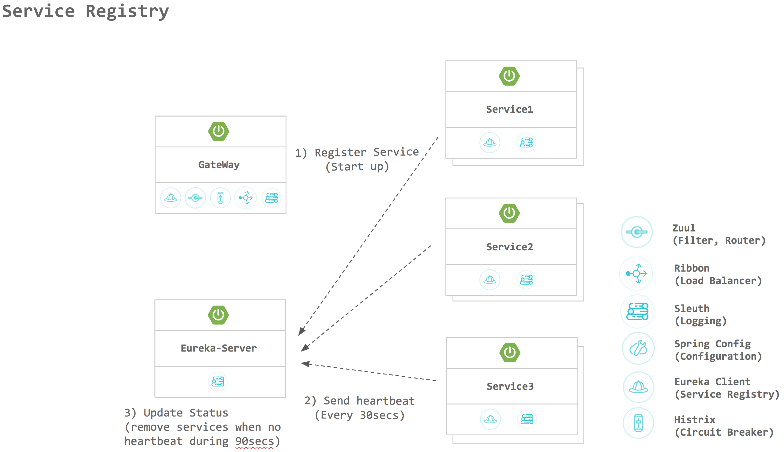

# Eureka 

Spring Cloud Netflix Eureka on chatbot ecosystem

## 시스템 요구사항

| Type      	| Tool         	| Version      	|
|-----------	|--------------	|--------------	|
| Compiler  	| Java         	| 1.8 이상     	|
| Builder   	| maven        	| 3.2 이상     	|
| Framework 	| Spring Boot  	| 2.0          	|
|           	| Spring Cloud 	| Finchley.RC2 	|

참고 : [Spring Cloud Dependency](http://projects.spring.io/spring-cloud/)

## 구성도

- other services for discovery

## Environment Variable
| Value      	| Description         	|
|-----------	|--------------	|
| PORT  	|  Server Port( default port: 7070)         	|
| EUREKA_SERVER_URL  	|  Eureka Server URI (ex>http://localhost)         	|
| EUREKA_SERVER_PORT  	|  Eureka Server PORT (default port: 7070)   	|